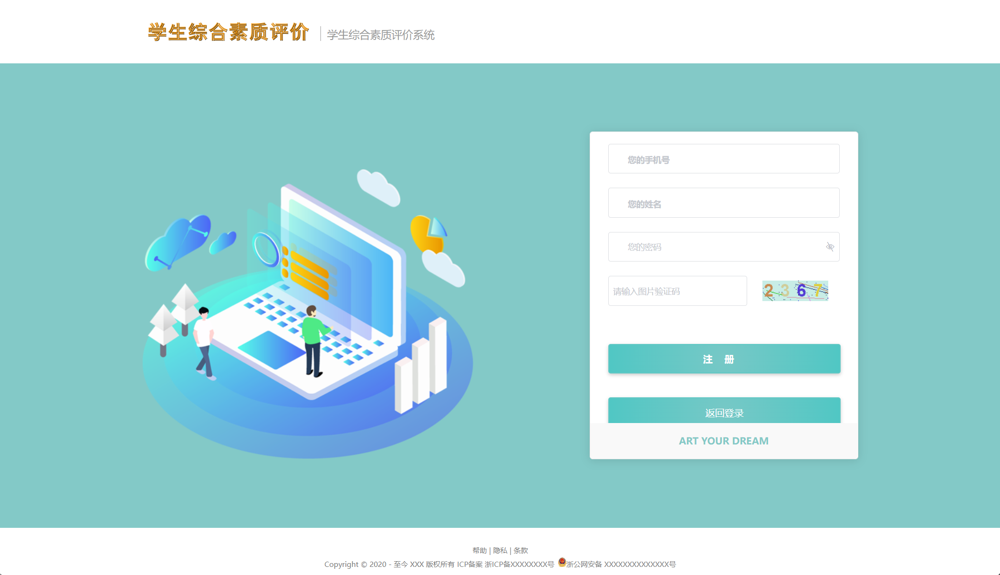

# 基于 Vue 和 SpringBoot 的学生综合素质评价系统

## 软件简介

本软件是**基于 Vue 和 SpringBoot 的学生综合素质评价系统**，包含了**学生端、教师端和教务处端**。

### 学生端功能

>**修改个人信息**
>
>**学业发展水平**（分三个部分，第一个是上学期均分（教师端填写，填写3门课语数外，然后自动计算）学生端只能查看，第二个部分是个自评问卷（内容和分值我会给），第三个部分是获奖情况（用下拉菜单之类的实现等级的区分，国家级，省级之类的，加分和这个有关），对应的加分数值我会给），前两个满分都是一百分，最后的得分取均分加上获奖情况的额外加分.
>
>**品德与社会化水平**（分两个部分，第一部分是自评问卷，第二部分是教师填写的问卷（教师端填写）自己只能查看填写结果）。满分都是一百分，最后的得分取均分。
>
>**身心健康水平**（分两个部分，第一部分是自评问卷，第二部分是教师填写的问卷，（教师端填写）自己只能查看填写结果，第三部分是教务处填写的体育考试分数）。三个满分都是一百分，最后的得分取均分。
>
>分数查看功能：查看三个部分的分数和综合分数（综合分数就是三个部分的均分）

### 教师端功能

>**修改个人信息**
>
>**评价学生学业发展水平**（填写学生上学期分数），没填写的学生会留存在这个页面，直到填写完毕为止。
>
>**评价学生品德与社会化水平**（填写问卷），没填写的学生会留存在这个页面，直到评价完毕为止。
>
>**查询学生信息**，只能查询属于自己的班级的（通过姓名或者学号，或者该学生是否评价完的状态（这里的评价完就是指自己有没有评价完，不管学生自评和教务处填写的东西），或者综合成绩的区间）。信息包括学号，姓名，班级，分数的查看（包括学业、品德、身心健康和综合成绩等四项）和是否已经完成评价

### 教务处功能

>**修改个人信息**
>
>**评价学生身心健康水平**（填写体育考试分数），没填写的学生会留存在这个页面，直到评价完毕为止。
>
>**查询学生信息**（通过姓名或者学号，或者班级，或者该学生是否评价完的状态（这里的评价完就是指自己有没有评价完，不管学生自评和教师填写的东西），或者综合成绩的区间），信息包括学号，姓名，分数的查看（包括学业、品德、身心健康和综合成绩等四项）和是否已经完成评价

### 其他亮点

>本系统采用了**基于角色的访问控制**，角色和菜单关联，一个角色可以配置多个菜单权限；然后再将用户和角色关联，一位用户可以赋予多个角色。这样用户就可以根据角色拿到该有的菜单权限，更方便管理者进行权限管控。
>
>本系统还自带**基于 beetl 代码生成器**功能，开发者只需要输入类名（如 Student）和类备注（如学生），运行 main 函数即可自动生成后端的所有 MVC 结构代码，无需开发增删改查的 API 接口。对于前端，开发者只需输入后端实体类的完整路径，利用 Java 的反射原理，拿到后端实体类的字段，即可自动生成前端所有代码，生成的模块代码包含基础的增删改查功能，简化开发者的工作量。

## 软件技术选型

### 前端

Vue：Vue 是构建前端界面的核心框架，本系统采用 2.6.14 版本。

View UI：基于 Vue.js 2 的组件库，本系统采用 4.7.0 版本。

### 后端

- Spring Boot：构建系统核心逻辑的后端框架，本系统采用 2.7.5 版本。
- MyBatis Plus：后端连接数据库的框架，本系统采用 3.5.2 版本。

### 数据库

- MySQL：本项目的主数据库，本系统采用 8.0.30 版本。
- Redis：本系统采用基于 Windows 版本的 Redis，用于图形验证码和用户菜单权限的临时存储，采用了 5.0.14.1 版本。

### 开发环境

- VsCode：项目前端的开发工具，使用版本为 1.68.0。
- IntelliJ IDEA ：项目后端的开发工具，使用版本为 2022.2.5。
- JDK：Java 的开发环境，使用版本为 17.0.5。
- Maven：后端项目的打包工具，使用版本为 3.6.2。
- NodeJs：前端项目的开发环境，使用版本为 16.13.0。

## 登录注册

基于 Vue 和 SpringBoot 的学生综合素质评价系统的登录界面如下图所示。

 

支持企业微信扫码登录，如下图所示。

 

支持用户自助注册，注册后默认角色为学生，如下图所示。

 

登录成功后，主界面如下图所示。

 

## 学生端

学生可进入学业自评模块，对自己的学业进行自评，如下图所示。

 

学生可自助登记自己的竞赛获奖情况，以便于加分，如下图所示。

 

登记竞赛的界面如下图所示。

 

学生还可填写对品德自评问卷，形成品德自评分数，如下图所示。

 

 学生还可填写对身心自评问卷，形成身心自评分数，如下图所示。

## 教师端

教师可对自己班级学生的语数外成绩进行打分，主界面如下图所示。

点击每一行学生数据的打分按钮，即可完成对学生语数外成绩的录入操作，如下图所示。

教师还可对学生的品德进行打分，主界面如下图所示。

问卷进入后，答题界面如下图所示。

同理还可以对学生的身心问卷进行打分，如下图所示。

身心问卷的打分界面如下图所示。

教师打分完成后，可以查询到学生的当前成绩，如下图所示。

学生成绩详情界面如下图所示。

## 教务处端

教务处人员可以对学生的体育成绩进行打分，主界面如下图所示。

点击每一行数据的修改体育得分按钮，即可完成打分操作，如下图所示。

打分完成后，教务处人员可查看学生的综合成绩，如下图所示。

学生综合成绩的详情界面如下图所示。

## 其他模块

学生综合素质评价系统支持对用户（含学生、教师、教务处人员）进行维护，如下图所示。

学生综合素质评价系统采用基于角色的访问控制，通过赋予用户角色，再配置角色拥有的菜单完成赋权，如下图所示。

学生综合素质评价系统支持对班级进行管理维护，如下图所示。

学生综合素质评价系统支持维护用户操作的日志，如下图所示。

学生综合素质评价系统支持维护角色数据，如下图所示。

学生综合素质评价系统支持用户自助修改登录密码，如下图所示。

学生综合素质评价系统支持用户的个人中心，自己修改自己的非关键信息，如下图所示。

## 免责声明

- 本项目开源，仅供个人学习使用，遵循 GPL-3.0 开源协议，**转发 / 商用授权请联系作者，否则后果自负**。
- 作者拥有本软件构建后的应用系统全部内容所有权及独立的知识产权。
- 如有问题，欢迎在仓库 Issue 留言，看到后会第一时间回复。相关意见会酌情考虑，但没有一定被采纳的承诺或保证。

下载本系统代码的用户，**必须同意以下内容，否则请勿下载**！

1. 出于自愿而使用/开发本软件，了解使用本软件的风险，且同意自己承担使用本软件的风险。
2. 利用本软件构建的网站的任何信息内容以及导致的任何版权纠纷和法律争议及后果和作者无关，作者对此不承担任何责任。
3. 在任何情况下，对于因使用或无法使用本软件而导致的任何难以合理预估的损失（包括但不仅限于商业利润损失、业务中断与业务信息丢失），作者概不承担任何责任。
4. 必须了解使用本软件的风险，作者不承诺提供一对一的技术支持、使用担保，也不承担任何因本软件而产生的难以预料的问题的相关责任。
